# Refaire les démonstrations, pas à pas

Ce guide reprend les douze démonstrations de la formation. Pour chacune : ce qu'elle montre, le schéma de ce qui est déployé, puis chaque étape du script avec la commande exécutée, la question à se poser avant de la lancer, ce que vous devez voir et pourquoi.

> **Mode d'emploi.** Lancez le script indiqué : il affiche chaque commande et attend `Entrée` avant de l'exécuter (`q` pour sortir). Avant chaque ❓, faites votre pronostic *avant* de dévoiler la réponse. Le montage de l'environnement est décrit dans le [README](../README.md).

| # | Jour | Démonstration | Script |
|---|---|---|---|
| [1](#démo-1) | Jour 1 | Épisode 1 — on containerise Shopix | `demos/j1-01-containers.sh` |
| [2](#démo-2) | Jour 1 | Le paysage, puis un cluster | `demos/j1-02-premier-cluster.sh` |
| [3](#démo-3) | Jour 1 | Le cerveau en action | `demos/j1-03-control-plane.sh` |
| [4](#démo-4) | Jour 1 | 3 réplicas, puis 10 | `demos/j1-04-objets-calcul.sh` |
| [5](#démo-5) | Jour 2 | OOMKilled, Pending et sondes | `demos/j2-01-placement-sante.sh` |
| [6](#démo-6) | Jour 2 | Le réseau, sans les mains | `demos/j2-02-reseau.sh` |
| [7](#démo-7) | Jour 2 | La donnée qui survit au Pod | `demos/j2-03-stockage.sh` |
| [8](#démo-8) | Jour 2 | RBAC, PSA, Secrets : la preuve | `demos/j2-04-securite.sh` |
| [9](#démo-9) | Jour 3 | La chasse au coupable | `demos/j3-01-observabilite.sh` |
| [10](#démo-10) | Jour 3 | GitOps en action | `demos/j3-02-gitops.sh` |
| [11](#démo-11) | Jour 3 | Shopix chez un fournisseur | `demos/j3-00-manage.sh` |
| [12](#démo-12) | Jour 3 | Vos règles, en YAML (Kyverno) | `demos/j3-03-kyverno.sh` |

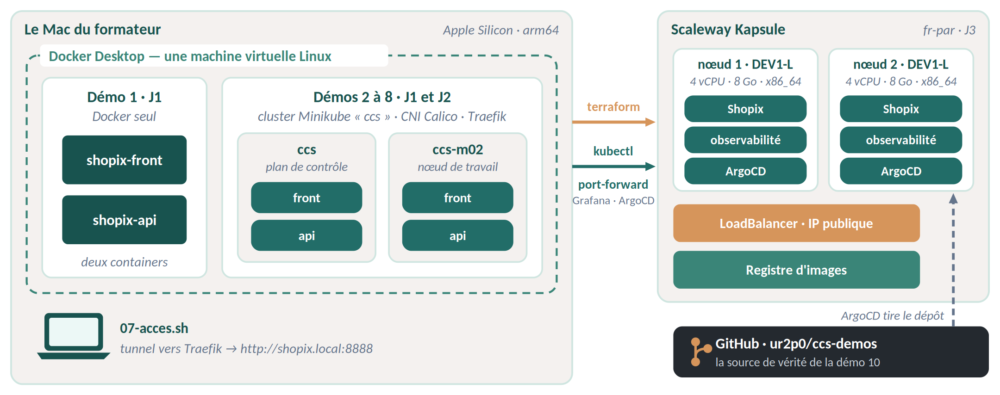


---

<a id="démo-1"></a>
## Démo 1 — Épisode 1 — on containerise Shopix

**Jour 1 · Module 2** · `./demos/j1-01-containers.sh`

**Ce que la démo montre.** Faire ressentir à la fois la simplicité du container et ses trous. Simplicité : une recette, une image, un démarrage en une seconde, rien d'installé sur le poste. Trous : la donnée, le réseau, les limites, le redémarrage, tout se fait à la main. Kubernetes doit arriver l'après-midi comme une réponse à ces trous, pas comme une mode.

> **Prérequis :** Docker seul, aucun cluster.

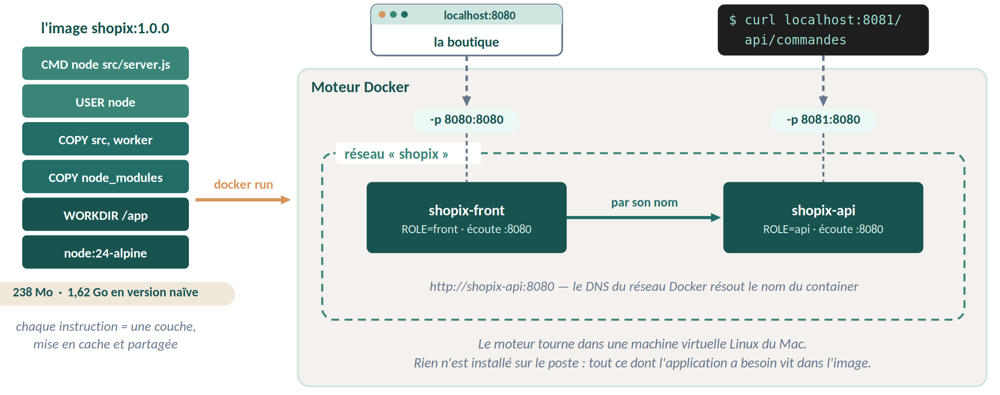


### 1. La recette : un Dockerfile, ligne à ligne

```sh
cat shopix/Dockerfile
```

**Ce que vous devez voir** — Le Dockerfile de production, en deux étapes (deps puis image finale), avec USER node, HEALTHCHECK et CMD en forme exec.

**Pourquoi** — Trois principes, à pointer du doigt dans le fichier : node:24-alpine (base minimale), package.json copié avant src (le cache des dépendances est séparé du code), USER node (uid 1000, pas root). Le multi-étape : l'image finale ne contient ni le cache npm ni les outils de build. Ne pas s'attarder, l'étape 2 rend tout ça concret.


### 2. On fabrique l'image, et on regarde les couches se créer

```sh
docker build --no-cache -t shopix:1.0.0 shopix
docker history shopix:1.0.0 --format 'table {{.CreatedBy}}\t{{.Size}}' | head -12
docker build -f shopix/Dockerfile.naif -t shopix:naif shopix
docker images shopix --format 'table {{.Repository}}:{{.Tag}}\t{{.Size}}'
```

**Ce que vous devez voir** — Le build pas à pas (--no-cache force une construction complète), l'historique des couches, puis le build naïf avec l'avertissement « JSON arguments recommended for CMD », et enfin les tailles : environ 238 Mo contre 1,62 Go.

**Pourquoi** — En forme shell (CMD npm start), le processus principal est un shell qui ne transmet pas SIGTERM : le container ne s'arrête pas proprement, il est tué au bout du délai. Le rapport de taille vient de la base (node:24 complète contre alpine) et de l'absence de multi-étape. Plus lourd veut dire plus long à tirer sur chaque nœud, et plus de paquets donc plus de CVE.


### 3. On modifie le code, on reconstruit

```sh
sed -i.bak 's/Le e-commerce qui tient la charge/Le e-commerce qui tient la charge ⚓/' shopix/src/server.js   (le script remet l'original juste après)
docker build -t shopix:1.0.1 shopix
```

❓ **Va-t-il tout refaire comme à l'instant, ou s'arrêter avant ?**

<details><summary>Réponse</summary>

Il reprend tout ce qui précède la copie du code depuis le cache (CACHED) et ne refait que les couches qui suivent COPY src. Le build prend une ou deux secondes.

</details>

**Ce que vous devez voir** — Une série de lignes CACHED, puis deux ou trois étapes réellement exécutées.

**Pourquoi** — La règle d'ordonnancement : du plus stable au plus changeant. Une modification invalide sa couche et toutes celles du dessus. Dans le Dockerfile naïf, COPY . /app est en tête : la moindre virgule changée relance toute l'installation. Le script remet le fichier source d'origine en silence juste après.


### 4. On lance, et on mesure le temps de démarrage

```sh
docker run -d --name shopix-api --network shopix -p 8081:8080 -e ROLE=api shopix:1.0.0
docker run -d --name shopix-front --network shopix -p 8080:8080 -e ROLE=front -e API_URL=http://shopix-api:8080 shopix:1.0.0
```

❓ **Combien de secondes entre la commande et une application qui répond ?**

<details><summary>Réponse</summary>

Environ une seconde. Le script affiche le délai réel mesuré.

</details>

**Ce que vous devez voir** — « ✔ Boutique ouverte : http://localhost:8080 ».

**Pourquoi** — Sur le schéma 01a : la même image lancée deux fois, avec deux rôles (ROLE=front, ROLE=api). Le front appelle http://shopix-api:8080 : c'est le DNS du réseau Docker « shopix » qui résout le nom du container. Les -p publient un port du container sur le poste ; sans eux, rien n'est joignable de l'extérieur. Un container démarre vite parce que ce n'est qu'un processus : pas de noyau à démarrer.

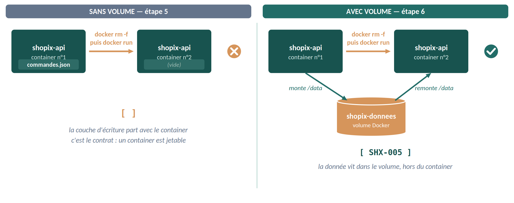


### 5. Le piège : un container ne retient rien

```sh
curl -s -XPOST 'localhost:8081/api/commandes?ref=SHX-003'
curl -s localhost:8081/api/commandes
docker rm -f shopix-api && docker run -d --name shopix-api … shopix:1.0.0
curl -s localhost:8081/api/commandes
```

❓ **Je détruis ce container et je le relance. La commande sera-t-elle encore là ?**

<details><summary>Réponse</summary>

Non : liste vide. La commande était écrite dans la couche d'écriture du container, supprimée avec lui.

</details>

**Ce que vous devez voir** — La commande SHX-003 listée, puis après recréation une liste vide et « ✘ Liste vide ».

**Pourquoi** — Moitié gauche du schéma 01b. Chaque container a une fine couche en écriture au-dessus des couches de l'image, en lecture seule. docker rm supprime cette couche. C'est ce qui rend le container reproductible : on repart toujours de l'image. Le prix : tout ce qui doit durer doit vivre ailleurs.


### 6. La réponse : sortir la donnée du container

```sh
docker volume create shopix-donnees
docker run … -v shopix-donnees:/data -e DATA_DIR=/data -e ROLE=api shopix:1.0.0
curl -s -XPOST 'localhost:8081/api/commandes?ref=SHX-005'
# destruction, relance avec le même volume
curl -s localhost:8081/api/commandes
```

❓ **Même manipulation : je détruis, je relance. Cette fois ?**

<details><summary>Réponse</summary>

La commande SHX-005 est toujours là : elle est dans le volume, monté sur /data par le nouveau container.

</details>

**Ce que vous devez voir** — « ✔ La commande a survécu : elle vit dans le volume, pas dans le container. »

**Pourquoi** — Moitié droite du schéma 01b. Le volume a son propre cycle de vie, indépendant du container.


### 7. L'illusion d'être seul au monde

```sh
docker exec shopix-api ps
docker top shopix-api
```

**Ce que vous devez voir** — Dans le container, node en PID 1 ; vu du moteur, le même processus avec un autre PID.

**Pourquoi** — Les namespaces Linux (PID, réseau, montage…) donnent à chaque container sa propre vue du système ; les cgroups limitent ce qu'il consomme. Même noyau pour tous : sur Mac, c'est celui de la machine virtuelle Linux de Docker Desktop, pas celui de macOS. C'est pour ça qu'une image arm64 ne tourne pas sur un nœud x86 (on le retrouvera au J3).


### 8. Et la limite qu'on pose soi-même

```sh
docker run -d --name shopix-bride -p 8082:8080 --memory=96m -e ROLE=api shopix:1.0.0
curl -s -m 5 'localhost:8082/leak?mo=300'
docker inspect shopix-bride --format 'statut=… · code=… · tué_faute_de_mémoire={{.State.OOMKilled}}'
```

❓ **Je lui demande d'allouer 300 Mo alors qu'il a droit à 96. Que va-t-il se passer ?**

<details><summary>Réponse</summary>

Il est tué par le noyau : statut exited, code 137, OOMKilled true.

</details>

**Ce que vous devez voir** — « statut=exited · code=137 · tué_faute_de_mémoire=true », puis « ✘ OOMKilled ».

**Pourquoi** — Le cgroup mémoire est un plafond dur : au-delà, le noyau tue le processus (SIGKILL, d'où 128 + 9 = 137). Pas de ralentissement, pas de négociation. C'est ce qui rend possible de mettre plusieurs clients sur la même machine. On retrouvera exactement ce scénario au J2, mais avec Kubernetes qui redémarre le container.

**À retenir**

- Simple, rapide, reproductible — et jetable par construction.
- Mais la donnée, le réseau, les limites, le redémarrage : tout ça, je l'ai fait à la main.
- À dix containers ça va. À trois cents, il faut quelqu'un dont c'est le métier : l'orchestrateur.

**Questions fréquentes**

- *« Pourquoi node_modules ne pèse que 12 ko ? »* Shopix n'a volontairement aucune dépendance externe, pour que le build tienne sans réseau en salle. L'étape npm ci est là pour montrer le motif : dépendances d'abord, code ensuite. Sur une vraie application, cette couche pèse des centaines de mégaoctets, et c'est pour ça qu'on la sépare.
- *« Un container, c'est une petite VM ? »* Non : pas de noyau à lui, pas de démarrage de système. C'est un processus du noyau hôte, avec une vue restreinte (namespaces) et un budget (cgroups). D'où la seconde de démarrage, et d'où l'isolation plus faible qu'une VM.
- *« Et Docker dans Kubernetes ? »* Kubernetes n'utilise plus Docker comme moteur depuis la 1.24 : il parle à containerd directement. Les images Docker restent parfaitement utilisables, c'est un format standard (OCI). On le verra dès la démo 2.

**Revenir à l'état de départ :** `./demos/reset.sh --docker`


---

<a id="démo-2"></a>
## Démo 2 — Le paysage, puis un cluster

**Jour 1 · Module 4** · `./demos/j1-02-premier-cluster.sh`

**Ce que la démo montre.** Deux temps. D'abord le vertige de la CNCF Landscape, assumé pour désamorcer le « c'est une usine à gaz ». Puis un vrai cluster qui répond en trois commandes : Kubernetes voit des nœuds, et ne veut rien savoir d'autre.


### 1. L'écosystème, en une image

```sh
# (pause) affichez landscape.cncf.io
```

❓ **À votre avis, combien de projets sont recensés sur la CNCF Landscape ?**

<details><summary>Réponse</summary>

Le chiffre du jour, affiché en haut de la page (plusieurs centaines de projets, plus d'un millier de cartes).

</details>

**Ce que vous devez voir** — La page de la Landscape.

**Pourquoi** — Ne pas commenter les logos. Le message : l'écosystème est immense, mais le cœur (un orchestrateur, un runtime, un réseau, un stockage, une observabilité) tient sur une page. C'est ce qu'on va construire pendant trois jours.


### 2. Un cluster, ça se fabrique en une commande

```sh
echo 'minikube start -p ccs --nodes=2 --cni=calico --cpus=4 --memory=6g'
minikube -p ccs status
```

**Ce que vous devez voir** — La commande de création (affichée, pas relancée), puis le statut : host, kubelet, apiserver Running sur les deux nœuds.

**Pourquoi** — Minikube crée deux containers Docker qui jouent chacun le rôle d'une machine : c'est un cluster jouet, mais un vrai Kubernetes. Calico est le plugin réseau (CNI) : on en aura besoin au J2 pour les NetworkPolicies.

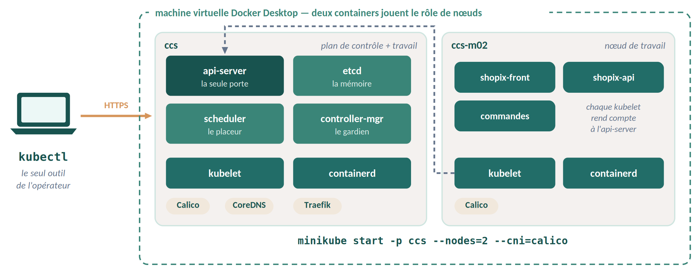


### 3. Premier contact

```sh
kubectl get nodes -o wide
kubectl cluster-info
kubectl get namespaces
```

❓ **Qu'est-ce que kubectl va me répondre : des serveurs, des machines virtuelles, autre chose ?**

<details><summary>Réponse</summary>

Des nœuds : ccs et ccs-m02, Ready, avec leur OS et leur runtime (containerd). Rien sur le Mac.

</details>

**Ce que vous devez voir** — Deux nœuds Ready, colonne CONTAINER-RUNTIME à containerd ; l'adresse de l'api-server ; les namespaces default, kube-system, shopix…

**Pourquoi** — Sur le nœud ccs, le plan de contrôle ; sur chaque nœud, kubelet et containerd. Chaque kubelet rend compte à l'api-server. Les namespaces sont des espaces de rangement logiques, pas des frontières de sécurité par défaut.

**À retenir**

- Un cluster, c'est deux choses : un cerveau qui décide, et des nœuds qui exécutent.
- On va ouvrir le cerveau.

**Questions fréquentes**

- *« Pourquoi Docker n'est plus le runtime ? »* Kubernetes parle à un runtime via une interface standard (CRI). containerd l'implémente directement ; Docker demandait une couche d'adaptation (dockershim), retirée en 1.24. Les images, elles, n'ont pas changé.
- *« En production, c'est pareil ? »* Même API, mêmes objets. La différence : le plan de contrôle est redondé (trois nœuds ou plus) et, en managé, il est opéré par le fournisseur. On le verra sur Kapsule au J3.


---

<a id="démo-3"></a>
## Démo 3 — Le cerveau en action

**Jour 1 · Module 4** · `./demos/j1-03-control-plane.sh`

**Ce que la démo montre.** La démonstration la plus importante des trois jours : la boucle de réconciliation. On ne pilote pas Kubernetes, on lui déclare une intention et il la maintient.


### 1. Les nœuds : ce que Kubernetes accepte de savoir

```sh
kubectl get nodes -o wide
```

**Ce que vous devez voir** — Les deux nœuds, leurs IP internes, leur OS, leur runtime.

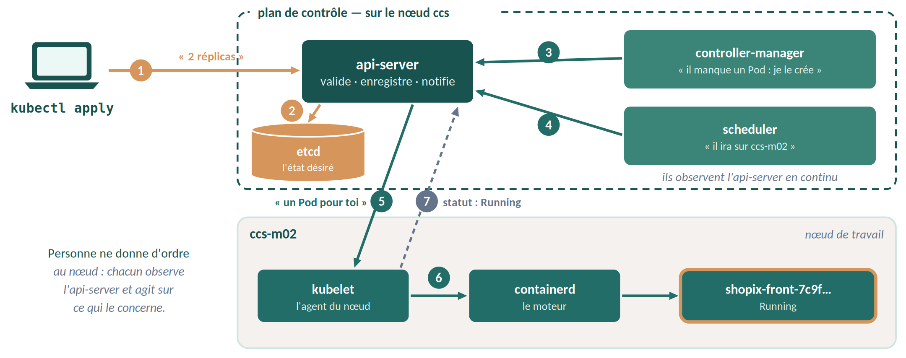


### 2. La salle des machines

```sh
kubectl get pods -n kube-system -o wide
```

**Ce que vous devez voir** — etcd-ccs, kube-apiserver-ccs, kube-scheduler-ccs, kube-controller-manager-ccs, coredns, calico-node sur chaque nœud, kube-proxy…

**Pourquoi** — Faites le lien avec 03a : chaque boîte du schéma est une ligne de cette liste. Le plan de contrôle tourne lui-même en Pods (statiques, lancés par le kubelet du nœud ccs). Le kubelet et containerd, eux, ne sont pas des Pods : ce sont des services du nœud.


### 3. Le désir, écrit quelque part

```sh
kubectl -n shopix get deploy shopix-front -o jsonpath='{.spec.replicas}'
kubectl -n shopix get pods -l composant=front -o wide
```

**Ce que vous devez voir** — « 2 réplicas demandés », puis deux Pods shopix-front Running.

**Pourquoi** — spec, c'est le voulu (stocké dans etcd) ; status, c'est le réel (remonté par les kubelets). Tout Kubernetes tient dans l'écart entre les deux.

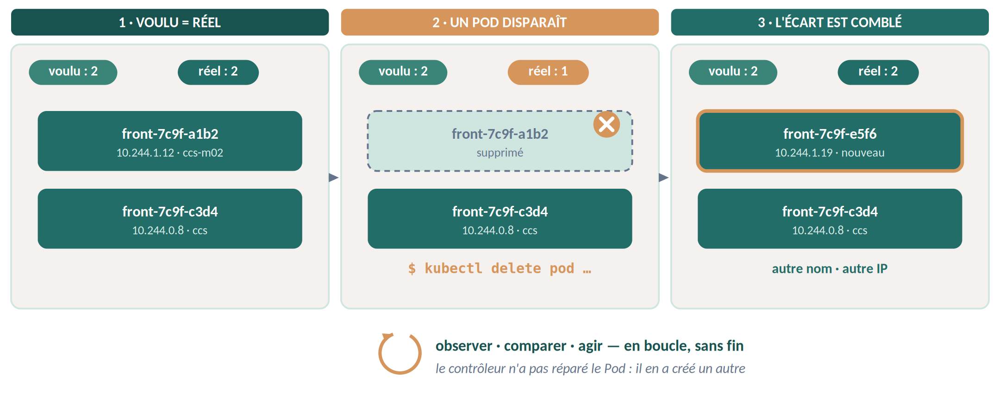


### 4. On casse

```sh
kubectl -n shopix delete pod <premier Pod front> --now
kubectl -n shopix get pods -l composant=front -o wide
```

❓ **Je supprime un Pod, sauvagement. Que se passe-t-il dans les deux secondes qui suivent ?**

<details><summary>Réponse</summary>

Un nouveau Pod est déjà créé, avec un autre nom et une autre IP : toujours deux réplicas.

</details>

**Ce que vous devez voir** — « ✔ Un nouveau Pod, un nouveau nom, une nouvelle IP — et toujours deux réplicas. »

**Pourquoi** — Observer, comparer, agir, en boucle. Deux conséquences à énoncer : ne jamais dépendre de l'IP d'un Pod (c'est le rôle du Service, démo 6), et ne rien stocker dans un Pod (démo 7).


### 5. La trace de la décision

```sh
kubectl -n shopix get events --sort-by=.lastTimestamp | tail -8
```

**Ce que vous devez voir** — Les événements récents : Killing, SuccessfulCreate, Scheduled, Pulled, Created, Started.

**Pourquoi** — Relisez-les avec les numéros de 03a : SuccessfulCreate (3, le controller), Scheduled (4, le scheduler), Pulled/Created/Started (5 et 6, le kubelet et containerd). Les events sont le premier réflexe de diagnostic, avant les logs.


### 6. La même chose, en couleur

```sh
(second terminal) k9s -n shopix
```

**Ce que vous devez voir** — La vue Pods de k9s.

**À retenir**

- On ne pilote pas Kubernetes : on lui déclare une intention, et il la maintient.
- Boucle de réconciliation : c'est le seul concept à retenir de cette demi-journée.

**Questions fréquentes**

- *« Et si c'est le nœud qui tombe ? »* Le kubelet ne rend plus compte, le nœud passe NotReady, et après un délai (environ cinq minutes par défaut) ses Pods sont recréés ailleurs. Même boucle, à l'échelle du nœud.
- *« Et si l'api-server tombe ? »* Les Pods continuent de tourner : les kubelets n'ont pas besoin de lui pour faire vivre ce qui existe déjà. Mais plus rien ne change, plus rien ne se répare. D'où un plan de contrôle redondé en production.


---

<a id="démo-4"></a>
## Démo 4 — 3 réplicas, puis 10

**Jour 1 · Module 4** · `./demos/j1-04-objets-calcul.sh`

**Ce que la démo montre.** Appliquer la boucle de réconciliation au calcul : Deployment → ReplicaSet → Pods, le passage à l'échelle en une commande, puis le contraste avec un Job, qui doit se terminer.

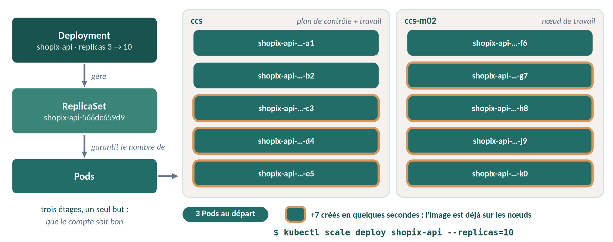


### 1. Qui commande qui

```sh
kubectl -n shopix get deploy,rs,pods -l composant=api
```

**Ce que vous devez voir** — deployment.apps/shopix-api, replicaset.apps/shopix-api-<hash>, deux pods shopix-api-<hash>-<suffixe>.

**Pourquoi** — Remarquez que le nom des Pods reprend celui du ReplicaSet. Pourquoi deux étages au-dessus des Pods : le Deployment crée un nouveau ReplicaSet à chaque changement d'image, ce qui permet la mise à jour progressive et le retour arrière.


### 2. On passe à trois

```sh
kubectl -n shopix scale deploy shopix-api --replicas=3
kubectl -n shopix get pods -l composant=api -o wide
```

**Ce que vous devez voir** — Trois Pods Running, sur ccs et ccs-m02.

**Pourquoi** — Le scheduler répartit selon les ressources disponibles et les règles (qu'on verra au J2).


### 3. On en supprime un, encore

```sh
kubectl -n shopix delete pod <un Pod api> --now && kubectl -n shopix get pods -l composant=api
```

❓ **Cette fois, combien de temps avant que le compte soit bon ?**

<details><summary>Réponse</summary>

Le remplaçant est déjà listé quand la commande rend la main.

</details>

**Ce que vous devez voir** — « ✔ Le ReplicaSet n'a pas attendu la fin de la commande pour recréer. »


### 4. Le Black Friday : de 3 à 10

```sh
time kubectl -n shopix scale deploy shopix-api --replicas=10
kubectl -n shopix get pods -l composant=api -o wide --no-headers | wc -l
```

❓ **Combien de secondes pour passer de 3 à 10 réplicas ?**

<details><summary>Réponse</summary>

La commande rend la main en une fraction de seconde (c'est une déclaration) ; les dix Pods sont prêts en quelques secondes.

</details>

**Ce que vous devez voir** — Le temps de la commande, l'attente « les dix Pods sont prêts », puis « 10 ».

**Pourquoi** — Distinguez les deux temps : kubectl scale ne fait qu'écrire replicas: 10 dans etcd (instantané) ; la réalisation prend quelques secondes parce que l'image est déjà sur les nœuds. Sur un nœud neuf, il faudrait d'abord tirer l'image : d'où l'intérêt des petites images (démo 1). Le script redescend à 2 juste après.

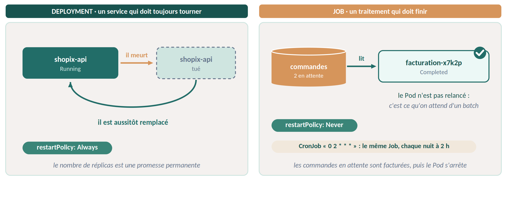


### 5. Et ce qui doit finir : la facturation de nuit

```sh
# deux commandes SHX-101 et SHX-102 déposées en silence
kubectl -n shopix apply -f k8s/demos/07-job-facturation.yaml
kubectl -n shopix get pods -l job-name=facturation
kubectl -n shopix logs job/facturation | tail -4
```

❓ **Un Deployment redémarre toujours ses Pods. Un Job, lui, va finir dans quel état ?**

<details><summary>Réponse</summary>

Completed, et il n'est pas relancé.

</details>

**Ce que vous devez voir** — Le Pod facturation-xxxxx en Completed, et les journaux de facturation des commandes en attente.

**Pourquoi** — Deployment : restartPolicy Always, le nombre de réplicas est une promesse permanente. Job : restartPolicy Never (ou OnFailure), la promesse est de terminer avec succès. Le CronJob relance le même Job à heure fixe (« 0 2 * * * » dans le manifeste). Le Job lit le même volume que shopix-commandes : on le reverra à la démo 7.

**À retenir**

- Shopix tourne, se répare toute seule, et encaisse dix fois plus de charge en une commande.
- Demain : comment elle se fait joindre, où elle range ses données, et qui a le droit de l'approcher.

**Questions fréquentes**

- *« Et qui décide de passer à 10 automatiquement ? »* L'HorizontalPodAutoscaler, à partir des métriques (CPU, ou métriques applicatives). On l'évoque au J3 avec l'observabilité.
- *« Pourquoi ne pas faire un Deployment qui s'arrête ? »* Parce qu'il serait redémarré en boucle : son contrat est de tourner. Un Job dit « termine, et dis-moi si tu as réussi », avec des relances bornées (backoffLimit).

**Revenir à l'état de départ :** `Le script redescend shopix-api à 2 réplicas tout seul.`


---

<a id="démo-5"></a>
## Démo 5 — OOMKilled, Pending et sondes

**Jour 2 · Module 4** · `./demos/j2-01-placement-sante.sh`

**Ce que la démo montre.** Quatre mini-scénarios pour toucher du doigt ce qui décide du placement et de la santé d'un Pod : la limite mémoire (le couperet), le taint et la toleration (le où), l'anti-affinité (le coût d'une règle stricte), les sondes (le quand : recevoir du trafic, être relancé).

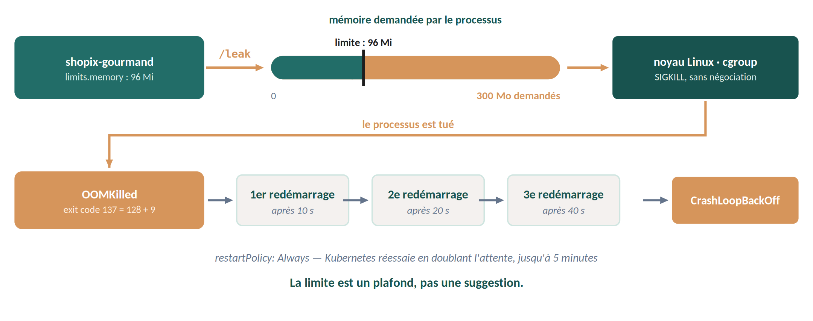


### 1. Scénario 1 — le Pod glouton

```sh
grep -A2 'limits' k8s/demos/01-oomkill.yaml | head -4
kubectl -n shopix apply -f k8s/demos/01-oomkill.yaml
kubectl -n shopix exec shopix-gourmand -- wget -q -T 5 -O- 'http://127.0.0.1:8080/leak?mo=300'
kubectl -n shopix get pod shopix-gourmand
kubectl -n shopix get pod shopix-gourmand -o jsonpath='{…lastState.terminated.reason}'
kubectl -n shopix get pod shopix-gourmand -o jsonpath='{…restartCount}'
```

❓ **Je lui demande d'allouer 300 Mo. Va-t-il ramer, planter, ou être tué ?**

<details><summary>Réponse</summary>

Tué : OOMKilled, exit code 137. Puis redémarré par le kubelet (RESTARTS à 1).

</details>

**Ce que vous devez voir** — « command terminated with exit code 137 », puis OOMKilled et « 1 redémarrage(s) ».

**Pourquoi** — Au-delà, SIGKILL : 128 + 9 = 137. Le kubelet relance le container ; si ça se répète, il espace les tentatives (10 s, 20 s, 40 s… jusqu'à 5 min) : c'est CrashLoopBackOff. C'est la démo 1 de Docker, avec en plus quelqu'un qui relance.

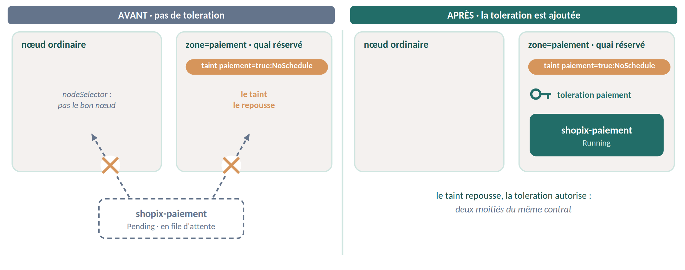


### 2. Scénario 2 — le quai réservé

```sh
kubectl taint nodes <nœud zone=paiement> paiement=true:NoSchedule --overwrite
kubectl -n shopix apply -f k8s/demos/02-taint-pending.yaml
kubectl -n shopix get pods -l composant=paiement
kubectl -n shopix describe pod -l composant=paiement | grep -A3 Events
kubectl -n shopix apply -f k8s/demos/03-taint-toleration.yaml
kubectl -n shopix get pods -l composant=paiement -o wide
```

❓ **Ce déploiement vise ce nœud, sans laissez-passer. Pending, ou CrashLoop ? — Puis : j'ajoute la toleration, combien de temps avant qu'il démarre ?**

<details><summary>Réponse</summary>

Pending (FailedScheduling : l'autre nœud n'a pas l'étiquette, celui-ci a un taint non toléré). Avec la toleration, il démarre en quelques secondes.

</details>

**Ce que vous devez voir** — Le Pod en Pending, l'event FailedScheduling « 0/2 nodes are available… », puis Running sur le nœud réservé.

**Pourquoi** — Deux mécanismes complémentaires : le nodeSelector zone=paiement attire le Pod vers le nœud (l'autre nœud ne convient pas), le taint repousse tout Pod qui ne le tolère pas. Il faut les deux pour un nœud réellement dédié : la toleration seule autorise, elle n'attire pas. Pending = problème de placement (lire les events) ; CrashLoop = problème d'exécution (lire les logs).

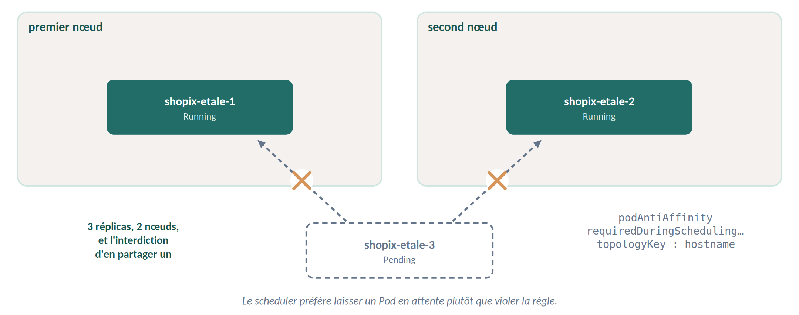


### 3. Scénario 3 — ne pas mettre tous ses œufs sur le même nœud

```sh
kubectl -n shopix apply -f k8s/demos/04-antiaffinite.yaml
kubectl -n shopix get pods -l composant=etale -o wide
kubectl -n shopix delete -f k8s/demos/04-antiaffinite.yaml
```

❓ **Trois réplicas, deux nœuds, et l'interdiction d'en partager un. Résultat ?**

<details><summary>Réponse</summary>

Deux Pods placés, un sur chaque nœud ; le troisième reste Pending.

</details>

**Ce que vous devez voir** — « ✘ Deux placés, un Pending : la règle est stricte, le scheduler préfère attendre que la violer. »

**Pourquoi** — Avec topologyKey hostname, l'unité est le nœud ; avec topology.kubernetes.io/zone, ce serait la zone. En production, on préfère souvent topologySpreadConstraints, qui répartissent sans bloquer.

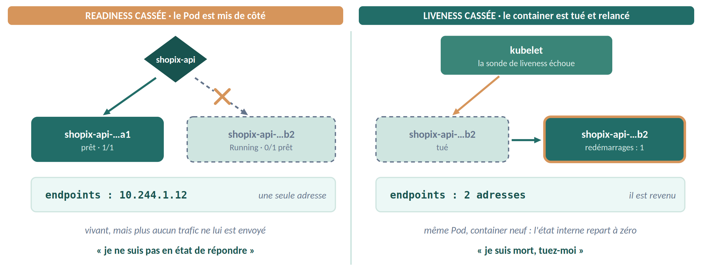


### 4. Scénario 4 — un Pod vivant, mais pas en état de servir

```sh
kubectl -n shopix get endpoints shopix-api
kubectl -n shopix exec <Pod api> -- wget -q -O- 'http://127.0.0.1:8080/admin/casser?cible=ready'
kubectl -n shopix get pods -l composant=api
kubectl -n shopix get endpoints shopix-api
kubectl -n shopix exec <même Pod> -- wget -q -O- 'http://127.0.0.1:8080/admin/casser?cible=live'
kubectl -n shopix get pod <même Pod>
```

❓ **Je casse sa sonde de readiness, pas sa liveness. Va-t-il être tué, ou juste mis de côté ? — Et si je casse la liveness ?**

<details><summary>Réponse</summary>

Readiness : il reste Running mais passe 0/1 prêt et disparaît des endpoints. Liveness : il est tué et relancé (RESTARTS à 1), et la sonde repasse.

</details>

**Ce que vous devez voir** — Endpoints : deux adresses, puis une seule. Puis le Pod redémarré, avec son compteur à 1.

**Pourquoi** — L'avertissement de dépréciation sur v1 Endpoints est un point de cours : EndpointSlice découpe la liste en tranches, indispensable au-delà de quelques centaines de Pods. Le redémarrage remet l'état interne à zéro : c'est pour ça que la sonde repasse (le « bug » était en mémoire). Troisième sonde à citer : startupProbe, qui protège les démarrages lents de la liveness.

**À retenir**

- Requests et limits décident du placement et du couperet.
- Taints, tolerations et affinités décident du où.
- Les sondes décident du quand : quand recevoir du trafic, quand être relancé.

**Questions fréquentes**

- *« C'est quoi ce exit code 137 ? »* 128 + 9, donc tué par SIGKILL. C'est la signature de l'OOMKill, pas une panne du script.
- *« Pourquoi kubectl m'avertit que Endpoints est déprécié ? »* v1 Endpoints est remplacé par EndpointSlice, qui découpe la liste en tranches : une liste unique devenait ingérable au-delà de quelques centaines de Pods.
- *« Et la limite CPU, elle tue aussi ? »* Non : au-delà de sa limite CPU, un container est ralenti (throttling), pas tué. La mémoire ne se reprend pas, le temps processeur si.

**Revenir à l'état de départ :** `./demos/reset.sh --j2  (retire les taints, les objets, répare les sondes)`


---

<a id="démo-6"></a>
## Démo 6 — Le réseau, sans les mains

**Jour 2 · Module 4** · `./demos/j2-02-reseau.sh`

**Ce que la démo montre.** 


### 1. Chaque Pod a son IP — et elle ne vaut rien

```sh
kubectl -n shopix get pods -l composant=api -o custom-columns=POD:…,IP:.status.podIP,NOEUD:…
kubectl -n shopix delete pod <Pod api> --now && kubectl … get pods -o custom-columns=POD,IP
```

**Ce que vous devez voir** — Les IP des Pods, puis une nouvelle IP pour le Pod recréé. « ✘ Nouvelle IP. »

**Pourquoi** — Le modèle réseau de Kubernetes : chaque Pod a une IP joignable depuis tout le cluster (c'est Calico qui le réalise). Mais l'IP naît et meurt avec le Pod : coder une IP de Pod en dur, c'est coder un numéro qui va changer.

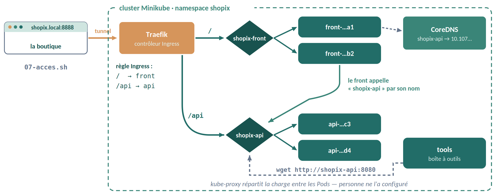


### 2. Le Service : un nom stable pour des Pods qui bougent

```sh
kubectl -n shopix get svc shopix-api
kubectl -n shopix exec tools -- cat /etc/resolv.conf
kubectl -n shopix exec tools -- nslookup shopix-api
kubectl -n shopix exec tools -- wget -q -O- http://shopix-api:8080/whoami
```

❓ **Depuis un autre Pod, que va donner un appel à « shopix-api » tout court ?**

<details><summary>Réponse</summary>

Il est résolu en l'IP du Service (ClusterIP), via le premier suffixe de recherche : shopix-api.shopix.svc.cluster.local. Le whoami répond.

</details>

**Ce que vous devez voir** — Le Service (ClusterIP), le resolv.conf (search shopix.svc.cluster.local svc.cluster.local cluster.local, options ndots:5), la réponse de nslookup suivie de lignes NXDOMAIN et d'un « code de sortie 1 », puis le JSON du whoami.

**Pourquoi** — Le point délicat, à expliquer plutôt qu'à masquer : ndots:5 veut dire qu'un nom de moins de cinq points est considéré comme court et complété par les suffixes de search, dans l'ordre. Le premier répond ; les NXDOMAIN qui suivent sont les autres suffixes, tentés pour rien. Vos applications paient ce coût aussi (d'où les noms complets terminés par un point en production). Le « code de sortie 1 » vient de busybox, qui sort en erreur dès qu'un suffixe échoue, même quand le nom a été résolu : ce n'est pas un échec.


### 3. Et la répartition, elle est où ?

```sh
for i in 1 … 10; do kubectl -n shopix exec tools -- wget -q -O- http://shopix-api:8080/whoami | grep -o '"pod": "…"'; done
```

**Ce que vous devez voir** — Dix lignes, où alternent les noms des deux Pods de l'API. « ✔ C'est kube-proxy, et personne ne l'a configuré. »

**Pourquoi** — Le Service n'est pas un processus : c'est une règle. kube-proxy, sur chaque nœud, programme le noyau (iptables ou IPVS) pour que l'IP du Service soit traduite vers l'un des Pods prêts (ceux des endpoints). Les Pods non prêts (démo 5) sont exclus.


### 4. Sortir du cluster : un seul point d'entrée

```sh
kubectl -n shopix get ingress shopix
# (pause) montrez la boutique sur http://shopix.local:8888, rechargez deux ou trois fois
```

**Ce que vous devez voir** — L'Ingress shopix (hôte shopix.local), puis la boutique dans le navigateur, avec le nom du Pod en haut de page.

**Pourquoi** — Sur 06a : le navigateur arrive sur Traefik, le contrôleur Ingress, qui applique les règles (/ → front, /api → api). L'Ingress est l'objet déclaratif, Traefik est le logiciel qui le réalise. Sur Mac, le tunnel 07-acces.sh est nécessaire parce que l'IP du nœud Minikube n'est pas routable depuis le poste. En cloud, Traefik aurait un LoadBalancer avec une IP publique (J3). Gateway API est son successeur.

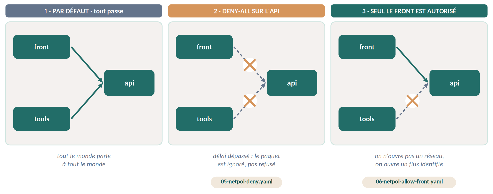


### 5. Par défaut, tout le monde parle à tout le monde

```sh
kubectl -n shopix exec tools -- wget -q -T 3 -O- http://shopix-api:8080/api/produits | head -c 120
```

**Ce que vous devez voir** — Le début du catalogue en JSON.

**Pourquoi** — Schéma 06b, panneau 1. Un Pod compromis n'importe où dans le cluster peut joindre n'importe quel autre : c'est le comportement par défaut.


### 6. On ferme tout

```sh
cat k8s/demos/05-netpol-deny.yaml
kubectl -n shopix apply -f k8s/demos/05-netpol-deny.yaml
kubectl -n shopix exec tools -- wget -q -T 5 -O- http://shopix-api:8080/api/produits
# (pause) rechargez la boutique
```

❓ **J'applique un deny-all sur l'API. Le front va-t-il continuer à afficher le catalogue ?**

<details><summary>Réponse</summary>

Non : le bandeau « catalogue indisponible » apparaît, et l'appel depuis tools finit en délai dépassé.

</details>

**Ce que vous devez voir** — « ↑ délai dépassé — le paquet est jeté, pas refusé », puis la boutique sans catalogue.

**Pourquoi** — Schéma 06b, panneau 2. La politique sélectionne les Pods composant=api, déclare le type Ingress, et ne liste aucune règle : tout ce qui entre est refusé. Dès qu'un Pod est sélectionné par une politique, il passe en liste blanche pour ce sens.


### 7. On rouvre, nominativement

```sh
cat k8s/demos/06-netpol-allow-front.yaml
kubectl -n shopix apply -f k8s/demos/06-netpol-allow-front.yaml
# (pause) rechargez la boutique
kubectl -n shopix exec tools -- wget -q -T 5 -O- http://shopix-api:8080/api/produits
```

❓ **J'autorise le front. Le Pod « tools », lui, va-t-il repasser aussi ?**

<details><summary>Réponse</summary>

Non : le catalogue revient dans la boutique, mais tools reste dehors (« ↑ toujours dehors »).

</details>

**Ce que vous devez voir** — La boutique retrouve son catalogue ; « ✔ Le front passe, l'outil reste dehors. »

**Pourquoi** — Schéma 06b, panneau 3. La règle autorise les Pods étiquetés composant=front, sur le port 8080, et rien d'autre. Les politiques s'additionnent : le deny-all reste en place, l'autorisation s'ajoute. L'identité, ici, c'est une étiquette : qui peut poser des étiquettes peut donc ouvrir des flux (lien avec le RBAC, démo 8). C'est le CNI (Calico) qui applique les règles : sans CNI compatible, elles sont acceptées mais ignorées.

**À retenir**

- Un nom stable, une répartition gratuite, un point d'entrée unique, et des flux déclarés.
- Le rayon d'impact d'un Pod compromis, c'est exactement ce que vous avez autorisé.

**Questions fréquentes**

- *« Pourquoi le DNS marche encore après le deny-all ? »* Parce que la politique ne porte que sur l'entrée des Pods de l'API. Un deny-all sur la sortie (Egress) couperait aussi le DNS : il faut alors l'autoriser explicitement vers kube-system, c'est le piège classique.
- *« Et le chiffrement entre Pods ? »* Les NetworkPolicies filtrent, elles ne chiffrent pas. Le chiffrement et l'identité forte (mTLS) viennent d'un service mesh ou du chiffrement du CNI (WireGuard avec Calico ou Cilium).

**Revenir à l'état de départ :** `kubectl -n shopix delete netpol --all  (le script suivant le fait aussi)`


---

<a id="démo-7"></a>
## Démo 7 — La donnée qui survit au Pod

**Jour 2 · Module 4** · `./demos/j2-03-stockage.sh`

**Ce que la démo montre.** Le crash test : la même image, deux déploiements, deux destins. shopix-api n'a pas de volume (chaque Pod a sa vérité, tout disparaît avec lui) ; shopix-commandes a un PVC (la donnée survit au Pod). Puis la chaîne PVC → StorageClass → PV, et la différence entre stockage local et stockage réseau.

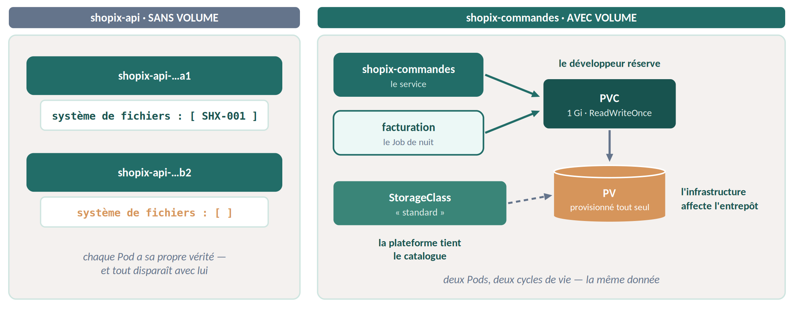


### 1. Rappel de la règle : sans volume, rien ne survit

```sh
kubectl -n shopix exec deploy/shopix-api -- wget … --post-data='' '…/api/commandes?ref=SHX-001'
kubectl -n shopix exec deploy/shopix-api -- wget -q -O- …/api/commandes
for p in $(kubectl -n shopix get pods -l composant=api -o name); do … /api/commandes; done
```

❓ **Deux Pods servent cette API. Le deuxième voit-il cette commande ?**

<details><summary>Réponse</summary>

Non : le premier Pod liste SHX-001, le second une liste vide.

</details>

**Ce que vous devez voir** — « ✘ Chaque Pod a sa propre vérité. C'est exactement le problème que le stockage partagé résout. »

**Pourquoi** — Moitié gauche de 07a. Deux problèmes en un : la donnée meurt avec le Pod, et deux réplicas divergent. Le second est souvent plus grave en production : des clients voient des états différents selon le Pod qui répond (répartition de la démo 6).


### 2. La réservation : PVC, PV, StorageClass

```sh
kubectl -n shopix get pvc shopix-commandes
kubectl get storageclass
kubectl -n shopix get pv | head -3
```

**Ce que vous devez voir** — Le PVC Bound, 1Gi, RWO, StorageClass standard ; la StorageClass standard (default) ; le PV pvc-<uid> correspondant.

**Pourquoi** — Moitié droite de 07a. Trois rôles : le développeur réserve (PVC : taille, mode d'accès), la plateforme tient le catalogue (StorageClass : quel provisionneur, quelles options), l'infrastructure fournit le disque (PV, créé à la demande). Le PVC est l'objet portable : le même YAML marche sur Minikube et sur Kapsule, seul le provisionneur change.

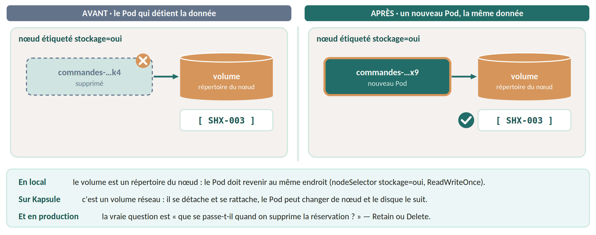


### 3. Le crash test

```sh
kubectl -n shopix exec deploy/shopix-commandes -- wget … '…/api/commandes?ref=SHX-003'
kubectl -n shopix delete pod <Pod commandes> --now
kubectl -n shopix get pods -l composant=commandes
kubectl -n shopix exec deploy/shopix-commandes -- wget -q -O- …/api/commandes
```

❓ **Je supprime ce Pod. La commande sera-t-elle encore là après ?**

<details><summary>Réponse</summary>

Oui : le nouveau Pod remonte le même PVC et relit SHX-003.

</details>

**Ce que vous devez voir** — « ✔ La commande a survécu. Le Pod est jetable, le volume ne l'est pas. »

**Pourquoi** — C'est la démo 1 (volume Docker), mais cette fois c'est le cluster qui a fourni le disque et qui le rattache au nouveau Pod.


### 4. Pourquoi ce Pod revient toujours sur le même nœud

```sh
kubectl -n shopix get pods -l composant=commandes -o custom-columns=POD:…,NOEUD:.spec.nodeName
grep -A2 nodeSelector k8s/base/commandes.yaml | head -3
```

**Ce que vous devez voir** — Le Pod sur le nœud étiqueté stockage=oui, et le nodeSelector dans le manifeste.

**Pourquoi** — Le bandeau du bas de 07b. Sur un cloud, le disque est un volume réseau : il se détache d'un nœud et se rattache à un autre, et le Pod peut bouger (l'overlay Scaleway retire ce nodeSelector). C'est la différence la plus visible entre local et managé, et elle explique l'existence de CSI, l'interface par laquelle chaque fournisseur branche son stockage.


### 5. Et la facturation de nuit lit le même entrepôt

```sh
kubectl -n shopix apply -f k8s/demos/07-job-facturation.yaml
kubectl -n shopix logs job/facturation | tail -3
```

**Ce que vous devez voir** — Les journaux du Job, qui facture les commandes lues dans le volume. « ✔ Un autre Pod, un autre cycle de vie — la même donnée. »

**Pourquoi** — Retour sur 07a : le Job de la démo 4 monte le même PVC. Deux Pods, deux cycles de vie (permanent et ponctuel), une donnée.

**À retenir**

- Le développeur réserve, la plateforme tient le catalogue, l'infrastructure affecte l'entrepôt.
- La vraie question de production n'est pas « comment », c'est « que se passe-t-il quand on supprime la réservation » : Retain ou Delete est une décision, pas un détail.

**Questions fréquentes**

- *« Et une base de données, on la met dans Kubernetes ? »* C'est possible (StatefulSet, opérateurs comme CloudNativePG), et de plus en plus courant. Mais la question est l'exploitation (sauvegardes, montées de version, bascule), pas le déploiement. Beaucoup d'équipes gardent la base en service managé.
- *« Que se passe-t-il si je supprime le PVC ? »* Ça dépend de la reclaimPolicy de la StorageClass : Delete (défaut courant) supprime le disque et la donnée ; Retain garde le PV pour une récupération manuelle.

**Revenir à l'état de départ :** `./demos/reset.sh --donnees  pour repartir d'une boutique vierge`


---

<a id="démo-8"></a>
## Démo 8 — RBAC, PSA, Secrets : la preuve

**Jour 2 · Module 4** · `./demos/j2-04-securite.sh`

**Ce que la démo montre.** Trois refus instructifs, et un qui n'a pas lieu. RBAC filtre qui parle à l'API ; Pod Security Admission filtre ce qu'un Pod a le droit d'être ; le Secret ne filtre rien du tout, il range.

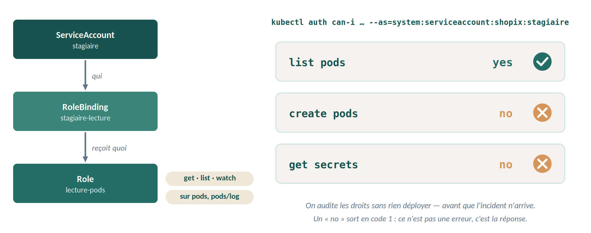


### 1. Refus n°1 — qui a le droit de faire quoi

```sh
cat k8s/demos/08-rbac-viewer.yaml
kubectl apply -f k8s/demos/08-rbac-viewer.yaml
kubectl -n shopix auth can-i list pods --as=system:serviceaccount:shopix:stagiaire
kubectl -n shopix auth can-i create pods --as=…
kubectl -n shopix auth can-i get secrets --as=…
```

❓ **Ce compte peut-il lister les Pods ? Et en créer un ?**

<details><summary>Réponse</summary>

yes, no, no.

</details>

**Ce que vous devez voir** — yes / no / no, avec « code de sortie 1 » après chaque no.

**Pourquoi** — ServiceAccount (qui), Role (quoi : verbes get/list/watch sur pods et pods/log), RoleBinding (le lien). Tout est interdit sauf ce qui est explicitement autorisé ; il n'y a pas de règle « deny ». Role et RoleBinding sont limités au namespace ; ClusterRole et ClusterRoleBinding valent pour tout le cluster. Le code de sortie 1 d'un « no » n'est pas une erreur : can-i répond aussi par son code de retour, pratique dans un script de contrôle. Dans l'autre sens : kubectl auth whoami.

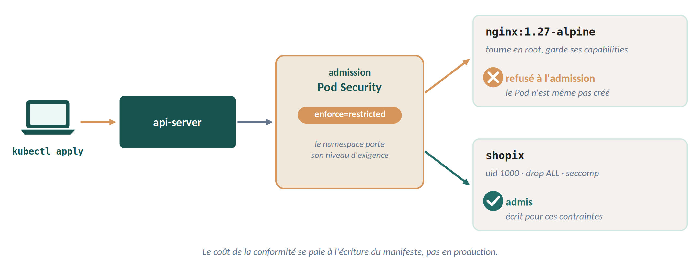


### 2. Refus n°2 — ce qu'un Pod a le droit d'être

```sh
kubectl get ns shopix -o jsonpath='{.metadata.labels}'
kubectl label ns shopix pod-security.kubernetes.io/enforce=restricted --overwrite
kubectl -n shopix apply -f k8s/demos/09-pod-root.yaml
kubectl -n shopix rollout restart deploy shopix-front
kubectl label ns shopix pod-security.kubernetes.io/enforce=baseline --overwrite
```

❓ **Le nginx officiel, celui que tout le monde déploie. Va-t-il passer ? — Et Shopix ?**

<details><summary>Réponse</summary>

nginx est refusé à l'admission (Forbidden, violates PodSecurity "restricted"). Shopix redémarre sans problème.

</details>

**Ce que vous devez voir** — Le message d'erreur qui liste les manques (allowPrivilegeEscalation, capabilities, runAsNonRoot, seccompProfile), puis le rollout de shopix-front qui se termine.

**Pourquoi** — PSA est un contrôleur d'admission intégré : il agit entre l'authentification et l'écriture dans etcd, donc le Pod n'existe jamais. Trois niveaux (privileged, baseline, restricted), trois modes (enforce, audit, warn). Shopix passe parce qu'elle a été écrite pour : uid 1000, drop ALL, seccomp RuntimeDefault. Le coût de la conformité se paie à l'écriture du manifeste. Le script revient en baseline pour la suite de la formation.

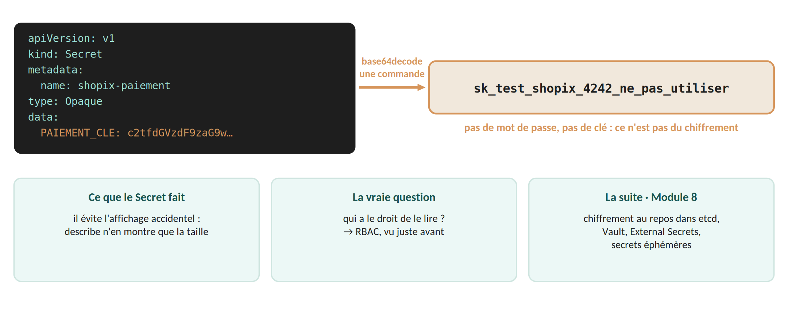


### 3. Refus n°3 — celui qui n'a pas lieu

```sh
kubectl -n shopix get secret shopix-paiement
kubectl -n shopix get secret shopix-paiement -o jsonpath='{.data.PAIEMENT_CLE}'
kubectl -n shopix get secret shopix-paiement -o go-template='{{.data.PAIEMENT_CLE | base64decode}}'
```

❓ **Un Secret Kubernetes, c'est chiffré ou encodé ?**

<details><summary>Réponse</summary>

Encodé en base64 : kubectl le décode lui-même en une commande, sk_test_shopix_4242_ne_pas_utiliser.

</details>

**Ce que vous devez voir** — c2tfdGVzdF9zaG9waXhfNDI0Ml9uZV9wYXNfdXRpbGlzZXI=, puis la valeur en clair.

**Pourquoi** — Protéger un Secret, c'est protéger son accès (RBAC : le stagiaire de l'étape 1 ne peut pas le lire), chiffrer etcd au repos, et idéalement ne pas stocker la valeur dans Kubernetes du tout (Vault, External Secrets) : Module 8. La valeur de la démo est fictive.

**À retenir**

- Trois vigiles différents : RBAC filtre qui parle à l'API, PSA filtre ce qu'un Pod peut être, et le Secret… ne filtre rien du tout. Il range.
- Moindre privilège : cluster-admin n'est jamais une réponse par défaut.

**Questions fréquentes**

- *« Et les Secrets dans Git, pour ArgoCD au J3 ? »* Jamais en clair. Sealed Secrets, SOPS, ou External Secrets qui va chercher la valeur dans un coffre. Le dépôt de la démo 10 ne contient qu'une valeur fictive.

**Revenir à l'état de départ :** `./demos/reset.sh --j2`


---

<a id="démo-9"></a>
## Démo 9 — La chasse au coupable

**Jour 3 · Module 7** · `./demos/j3-01-observabilite.sh`

**Ce que la démo montre.** Résoudre l'incident annoncé en ouverture du module : « Shopix rame une fois sur cent ». C'est une démonstration de méthode, pas d'outil : on ne devine pas, on découpe (global, puis route, puis Pod, puis journaux).

> **Prérequis :** la pile du jour 3 (observabilité, ArgoCD, dépôt GitOps) — voir la section « Jour 3 » du [README](../README.md).

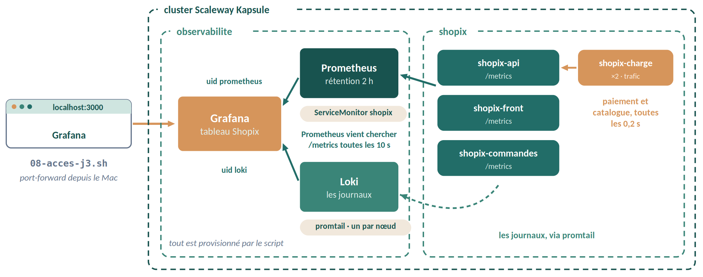

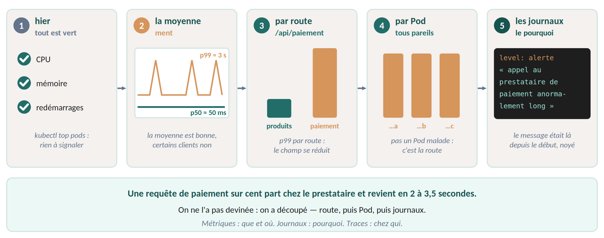


### 1. Ce que disait le monitoring d'hier

```sh
kubectl top pods -n shopix
kubectl -n shopix get pods -l composant=api
```

**Ce que vous devez voir** — Des consommations faibles, des Pods Running sans redémarrage. « ✘ Et pourtant le client a raison. »

**Pourquoi** — Schéma 09b, panneau 1. Le monitoring classique surveille l'infrastructure : il répond à des questions prévues (« le CPU dépasse-t-il 80 % ? »). L'incident du jour n'est pas dans ces questions.


### 2. La moyenne, ce mensonge confortable

```sh
# (pause) panneau « Temps de réponse global — p50 / p95 / p99 »
```

❓ **La p50 est à quelques dizaines de millisecondes. Combien de clients attendent plus de 2 secondes ?**

<details><summary>Réponse</summary>

Un pour cent des paiements : la p99 est vers 2 à 3 secondes. Sur dix mille commandes par jour, cent clients mécontents, invisibles dans la moyenne.

</details>

**Ce que vous devez voir** — Dans Grafana : p50 plate autour de 20 à 60 ms, p99 en dents de scie vers 2 à 3 s.

**Pourquoi** — Schéma 09b, panneau 2. Un percentile se lit « 99 % des requêtes sont plus rapides que cette valeur ». La moyenne écrase les cas rares ; ce sont eux que les clients retiennent. Les objectifs de service (SLO) s'écrivent en percentiles.


### 3. Premier découpage : quelle route ?

```sh
# (pause) panneau « p99 PAR ROUTE »
echo 'histogram_quantile(0.99, sum by (le, route) (rate(shopix_request_duration_seconds_bucket[5m])))'
```

**Ce que vous devez voir** — La courbe /api/paiement décroche seule ; le catalogue est plat. La requête PromQL du panneau s'affiche dans le terminal.

**Pourquoi** — Schéma 09b, panneau 3. Lisez la requête : l'application expose un histogramme (des compteurs par tranche de durée) ; rate calcule le débit sur 5 minutes ; sum by (le, route) regroupe par route ; histogram_quantile estime la p99. C'est possible parce que Shopix étiquette ses métriques par route.


### 4. Deuxième découpage : un Pod malade, ou la route elle-même ?

```sh
# (pause) panneau « Et par Pod »
```

❓ **Si un seul Pod était en cause, que verrait-on sur ce panneau ?**

<details><summary>Réponse</summary>

Une seule courbe qui décroche. Ici, tous les Pods décrochent de la même façon : ce n'est pas un Pod, c'est ce que fait la route.

</details>

**Ce que vous devez voir** — Les courbes des deux Pods de l'API, superposées.

**Pourquoi** — Schéma 09b, panneau 4. Si c'était un Pod, on le supprimerait (démo 3) et le problème disparaîtrait. Comme c'est la route, supprimer des Pods ne sert à rien : il faut comprendre ce qu'elle fait. On a changé de question.


### 5. La confirmation, dans les journaux

```sh
kubectl -n shopix logs -l composant=api --tail=300 --prefix | grep -c 'lent'
kubectl -n shopix logs -l composant=api --tail=300 | grep 'lent' | tail -3
# Grafana : panneau « Journaux — uniquement les alertes de Shopix »
```

**Ce que vous devez voir** — Quelques lignes JSON level « alerte » : « appel au prestataire de paiement anormalement long ». Le même filtre dans le panneau Loki de Grafana.

**Pourquoi** — Schéma 09b, panneau 5. Le message était là depuis le début, noyé dans des milliers de lignes : sans le découpage, personne ne l'aurait cherché. Le panneau Loki montre la corrélation sur la même fenêtre de temps que les métriques. Les traces (OpenTelemetry) diraient quel appel externe, et combien de temps chacun a pris.


### 6. Le revers : la cardinalité

```sh
kubectl -n shopix get pods -l app=shopix --no-headers | wc -l
```

**Ce que vous devez voir** — Le nombre de Pods Shopix. « ✘ C'est là que la facture d'observabilité explose. »

**Pourquoi** — Nombre de séries = produit des valeurs de chaque étiquette (Pods × routes × codes × tranches d'histogramme). Et chaque Pod recréé crée de nouvelles séries. C'est pour ça qu'on ne met jamais d'identifiant client ou de numéro de commande en étiquette, et pourquoi des solutions comme VictoriaMetrics ou Mimir existent.

**À retenir**

- On n'a pas deviné : on a découpé. Route, puis Pod, puis journaux.
- L'observabilité, ce n'est pas plus de tableaux de bord : c'est la capacité de poser une question qu'on n'avait pas prévue.

**Questions fréquentes**

- *« Pourquoi pas une alerte sur la moyenne ? »* Parce qu'elle ne bougera pas : 1 % de requêtes à 3 s fait monter la moyenne de quelques dizaines de millisecondes. On alerte sur un percentile ou sur un taux d'erreur par rapport à un SLO.
- *« Prometheus garde tout ? »* Ici, 2 heures (réglé pour la démo). En production, quelques semaines en local, et un stockage long terme à côté (Thanos, Mimir, VictoriaMetrics).


---

<a id="démo-10"></a>
## Démo 10 — GitOps en action

**Jour 3 · Module 7** · `./demos/j3-02-gitops.sh`

**Ce que la démo montre.** Provoquer une dérive et regarder la plateforme la corriger toute seule, puis montrer le bon chemin : on ne touche plus au cluster, on change le dépôt. C'est la boucle de réconciliation du J1, sortie du cluster et appliquée à la plateforme entière.

> **Prérequis :** la pile du jour 3 (observabilité, ArgoCD, dépôt GitOps) — voir la section « Jour 3 » du [README](../README.md).

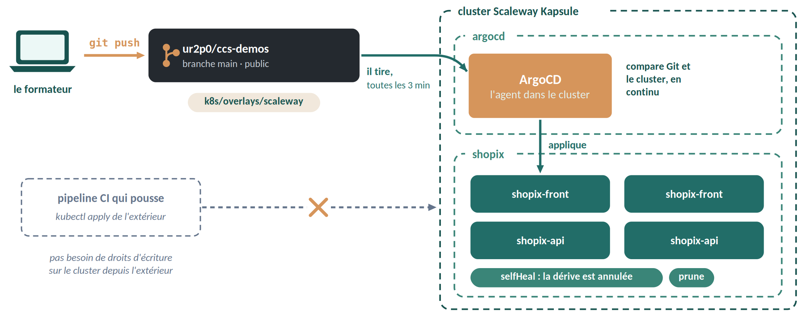


### 1. Qui décide de ce qui tourne ici ?

```sh
kubectl -n argocd get applications
# (pause) arbre de l'application shopix dans ArgoCD
```

**Ce que vous devez voir** — L'application shopix, SYNC STATUS Synced, HEALTH STATUS Healthy ; dans l'interface, l'arbre Deployment → ReplicaSet → Pods.

**Pourquoi** — Sur 10a : l'application ArgoCD pointe sur votre copie (fork) du dépôt, branche main, chemin k8s/overlays/minikube (ou scaleway sur Kapsule). L'arbre d'ArgoCD est exactement le 04a du J1 : Deployment, ReplicaSet, Pods. Synced compare le contenu ; Healthy dit si les objets fonctionnent.

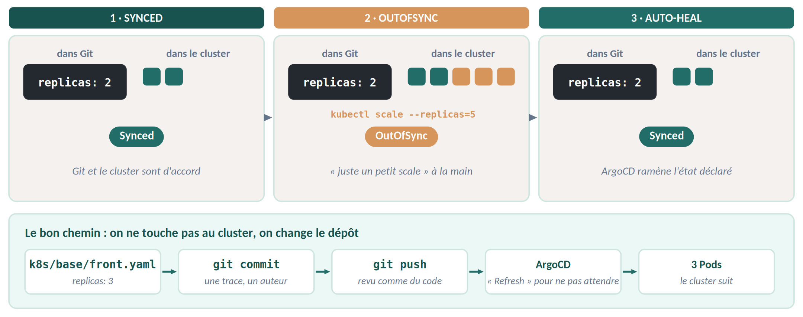


### 2. Le vendredi soir, quelqu'un fait « juste un petit scale »

```sh
kubectl -n shopix get deploy shopix-front
kubectl -n shopix scale deploy shopix-front --replicas=5
kubectl -n shopix get pods -l composant=front --no-headers | wc -l
```

❓ **Je passe à cinq réplicas à la main. Combien y en aura-t-il dans une minute ?**

<details><summary>Réponse</summary>

Deux : ArgoCD va annuler la modification. Pour l'instant, il y en a cinq.

</details>

**Ce que vous devez voir** — « 5 ». « ✔ Cinq. Pour l'instant, le coupable a gagné. »

**Pourquoi** — Schéma 10b, panneau 2.


### 3. Sauf qu'il y a un témoin

```sh
# (pause) ArgoCD passe OutOfSync
kubectl -n argocd get applications -o custom-columns=NOM:…,SYNC:…,SANTE:…
```

**Ce que vous devez voir** — OutOfSync dans l'interface, le Deployment shopix-front marqué en jaune, avec le diff replicas: 2 → 5.

**Pourquoi** — Ouvrez le diff dans l'interface : c'est la preuve lisible par un auditeur. Selon la vitesse, la resynchronisation a parfois déjà eu lieu ; dans ce cas, consultez l'historique des événements de l'application.


### 4. Et il ne se contente pas de regarder

```sh
kubectl -n shopix get deploy shopix-front
```

❓ **Auto-heal est activé. Que devient mon scale à cinq ?**

<details><summary>Réponse</summary>

Il revient à deux tout seul, en quelques secondes.

</details>

**Ce que vous devez voir** — shopix-front 2/2. « ✔ Revenu à deux. Ma modification manuelle a été écrasée — et c'est le comportement souhaité. »

**Pourquoi** — Schéma 10b, panneau 3. selfHeal ramène ce qui dérive dans le cluster ; prune supprime du cluster ce qui a disparu de Git. Les deux sont des choix : sans selfHeal, ArgoCD signale mais ne corrige pas, ce que certaines équipes préfèrent au début.


### 5. Alors comment fait-on, pour de vrai ?

```sh
# à faire vous-même : k8s/base/front.yaml : replicas: 2 → 3
git commit -am "front : 3 réplicas" && git push
# ArgoCD : bouton Refresh
kubectl -n argocd get applications -o custom-columns=NOM:…,SYNC:…,REVISION:…
```

**Ce que vous devez voir** — Le push, puis dans ArgoCD la nouvelle révision (le hash du commit) et un troisième Pod front. « ✔ Une revue de code, une trace, un auteur, une date. »

**Pourquoi** — Le bandeau du bas de 10b. En vrai, ce commit passerait par une pull request relue. ArgoCD scrute le dépôt toutes les 3 minutes : cliquez Refresh pour ne pas attendre (ou un webhook GitHub en production). La révision affichée est le hash du commit : de n'importe quel état du cluster, on remonte à l'auteur et à la raison.

**À retenir**

- Le dépôt décrit l'intention, l'agent maintient la réalité.
- C'est la boucle de réconciliation du J1, sortie du cluster et appliquée à la plateforme entière.

**Questions fréquentes**

- *« Et en cas d'urgence, on ne peut plus rien faire à la main ? »* On peut suspendre la synchronisation automatique d'une application, intervenir, puis reporter la correction dans Git. L'important est que le retour à Git soit la règle, et l'exception tracée.
- *« Et les secrets, ils sont dans Git ? »* Pas en clair : Sealed Secrets, SOPS, ou External Secrets (lien avec la démo 8 et le Module 8).
- *« ArgoCD ou Flux ? »* Même principe (un agent qui tire). ArgoCD a une interface qui parle aux équipes ; Flux est plus léger et tout en CRD. Les deux sont gradués CNCF.

**Revenir à l'état de départ :** `git revert --no-edit HEAD && git push, puis Refresh dans ArgoCD : retour à 2 réplicas, avec l'historique complet.`


---

<a id="démo-11"></a>
## Démo 11 — Shopix chez un fournisseur

**Jour 3 · Module 6** · `./demos/j3-00-manage.sh`

**Ce que la démo montre.** Montrer ce que « managé » veut dire concrètement : les mêmes manifestes qu'en local, réalisés par les services du fournisseur. Le plan de contrôle disparaît de la vue, les nœuds sont des instances, un Service devient un load balancer, un PVC devient un disque réseau qui suit le Pod d'un nœud à l'autre. Et c'est aussi la limite : ce qui est portable, c'est le YAML, pas le service qu'il commande.

> **Prérequis :** un cluster Scaleway Kapsule (option payante) — voir « Option : sur un cluster managé Scaleway Kapsule » dans le [README](../README.md). Le script refuse de tourner ailleurs.

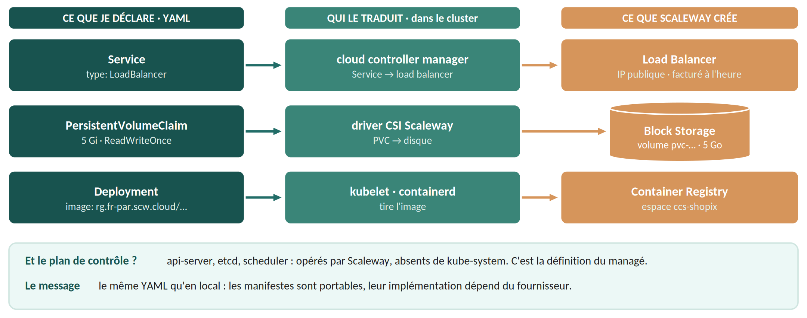


### 1. Le même Shopix qu'en local, à trois lignes près

```sh
diff <(kubectl kustomize k8s/overlays/minikube) <(kubectl kustomize k8s/overlays/scaleway) | grep '^[<>]'
```

**Ce que vous devez voir** — Une poignée de lignes : les noms d'image (shopix:1.0.0 → rg.fr-par.scw.cloud/ccs-shopix/shopix:1.0.0), le PVC 1Gi → 5Gi, le nodeSelector stockage=oui qui disparaît, `type: LoadBalancer` sur shopix-front.

**Pourquoi** — Kustomize : une base commune, un overlay par environnement. C'est la bonne pratique pour garder un seul manifeste de référence (Module 7, packaging). Le 5 Gi vient d'une taille minimale du stockage bloc ; le nodeSelector disparaît parce que le disque n'est plus local.


### 2. Où est passé le cerveau ?

```sh
kubectl get pods -n kube-system
```

❓ **Au J1, on voyait l'api-server et etcd dans kube-system. Et ici ?**

<details><summary>Réponse</summary>

Ils n'y sont pas : le plan de contrôle est opéré par Scaleway, hors de vue. On ne voit que ce qui tourne sur nos nœuds (Cilium, CoreDNS, les agents CSI).

</details>

**Ce que vous devez voir** — cilium, coredns, csi-node, konnectivity-agent, metrics-server… mais ni kube-apiserver, ni etcd, ni kube-scheduler.

**Pourquoi** — En managé, le fournisseur les opère, les sauvegarde et les met à jour (fenêtre de maintenance le dimanche à 3 h ici). En échange, on n'y a plus accès : pas de réglage fin d'etcd, pas de flags de l'api-server.


### 3. Les nœuds sont des instances

```sh
kubectl get nodes -L node.kubernetes.io/instance-type -L topology.kubernetes.io/zone
kubectl get nodes -o custom-columns=NOEUD:.metadata.name,INSTANCE:.spec.providerID
# (pause) console → Kubernetes → le pool
```

**Ce que vous devez voir** — Deux nœuds DEV1-L en fr-par-1, et un providerID en scaleway://instance/…

**Pourquoi** — Les étiquettes instance-type et zone sont posées par le fournisseur : c'est sur elles qu'on règle l'anti-affinité par zone ou le placement des Pods sur des nœuds GPU (démo 5). Dans la console, montrez le pool : taille, type, autohealing (un nœud malade est remplacé automatiquement).


### 4. Le réseau : un vrai load balancer, commandé par Kubernetes

```sh
kubectl -n shopix get svc shopix-front
kubectl -n shopix expose deploy shopix-front --name=vitrine --type=LoadBalancer --port=80 --target-port=8080 --labels=demo=vitrine
kubectl -n shopix get svc vitrine
kubectl -n shopix get events --field-selector involvedObject.name=vitrine
# (pause) navigateur sur l'IP, puis console → Load Balancers
kubectl -n shopix delete svc vitrine
```

❓ **Je déclare un second Service LoadBalancer. Combien de temps avant qu'il ait sa propre IP publique ?**

<details><summary>Réponse</summary>

Une à deux minutes : le temps que le cloud controller manager commande un load balancer à l'API Scaleway et qu'il soit provisionné. Le script affiche le délai réel.

</details>

**Ce que vous devez voir** — EXTERNAL-IP en <pending>, puis une IP publique ; les événements EnsuringLoadBalancer puis EnsuredLoadBalancer ; la boutique accessible sur cette IP ; le load balancer dans la console.

**Pourquoi** — Le cloud controller manager est le composant du fournisseur qui fait le pont entre les objets Kubernetes et son API : Service → load balancer, nœud → instance. Sur Minikube, le même Service serait resté en <pending> pour toujours (d'où le tunnel du J2). C'est aussi un point FinOps : chaque Service LoadBalancer est une ressource facturée, d'où l'intérêt d'un seul Ingress ou d'une Gateway devant plusieurs applications.

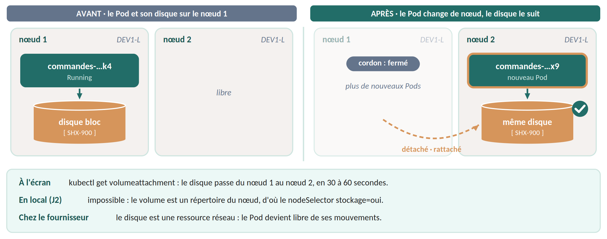


### 5. Le stockage : un disque réseau qui suit le Pod

```sh
kubectl get storageclass
kubectl get pv -o custom-columns=VOLUME:…,TAILLE:…,PILOTE:.spec.csi.driver,RECLAMATION:…
kubectl -n shopix exec deploy/shopix-commandes -- wget … '…/api/commandes?ref=SHX-900'
kubectl get volumeattachment -o custom-columns=DISQUE:…,NOEUD:…,ATTACHE:…
kubectl cordon <nœud du Pod>
kubectl -n shopix delete pod -l composant=commandes --wait=false
kubectl -n shopix get pod -l composant=commandes -o wide
kubectl get volumeattachment …
kubectl -n shopix exec deploy/shopix-commandes -- wget -q -O- …/api/commandes
kubectl uncordon <nœud>
```

❓ **Au J2, en local, le Pod devait revenir sur le même nœud. Ici, il part sur l'autre. Retrouvera-t-il SHX-900 ?**

<details><summary>Réponse</summary>

Oui : le disque se détache du premier nœud et se rattache au second, en 30 à 60 secondes. Autre nœud, même disque, même donnée.

</details>

**Ce que vous devez voir** — La StorageClass par défaut du fournisseur, un PV servi par le pilote CSI Scaleway, le VolumeAttachment sur le premier nœud, puis sur le second ; SHX-900 toujours là.

**Pourquoi** — C'est exactement ce qui était impossible au J2 (le bandeau de 07b) : en local, le volume est un répertoire du nœud. Ici, le pilote CSI traduit le PVC en disque bloc Scaleway, et Kubernetes orchestre le détachement et le rattachement. `kubectl cordon` est le geste de début de maintenance d'un nœud ; `drain` irait plus loin en évacuant tous les Pods. Montrez le volume pvc-… dans la console, rubrique Block Storage.


### 6. Et tout cela a un prix

```sh
# (pause) console → Facturation
```

**Ce que vous devez voir** — La consommation du jour : environ 2 € pour les nœuds, quelques dizaines de centimes pour le load balancer, quelques centimes pour le disque.

**Pourquoi** — Transition vers le FinOps du Module 9 : la facture se lit par ressource, et chaque objet Kubernetes qui commande une ressource du fournisseur (Service LoadBalancer, PVC) a un coût. Le plan de contrôle Kapsule est gratuit dans cette offre ; ce n'est pas le cas partout (EKS le facture à l'heure).

**À retenir**

- Les manifestes sont portables ; leur réalisation dépend du fournisseur : load balancer, disque, registre, instances.
- C'est la force du managé… et le début de la dépendance : ce qui est portable, c'est le YAML, pas le service qu'il commande.

**Questions fréquentes**

- *« Et si on change de fournisseur ? »* Les manifestes suivent, à l'overlay près : StorageClass, annotations du load balancer, nom du registre. Ce qui ne suit pas, ce sont les services managés consommés à côté (base de données, IAM, files de messages). C'est la stratégie de sortie du Module 5.
- *« Le plan de contrôle est-il facturé ? »* Chez Scaleway, pas dans l'offre utilisée ici ; chez AWS, EKS facture le plan de contrôle à l'heure ; les offres varient, et c'est un critère de choix du Module 6.

**Revenir à l'état de départ :** `automatique (nœud rouvert, vitrine supprimée) ; à la main : kubectl uncordon <nœud> && kubectl -n shopix delete svc vitrine`


---

<a id="démo-12"></a>
## Démo 12 — Vos règles, en YAML (Kyverno)

**Jour 3 · Module 8** · `./demos/j3-03-kyverno.sh`

**Ce que la démo montre.** Montrer la politique comme code : le PSA de la démo 8 applique des niveaux standard, Kyverno applique les règles que l'équipe écrit elle-même — ici, pas d'image sans version et une limite mémoire obligatoire. Refus à l'admission avec un message clair, génération automatique pour les Deployments, test à blanc, puis mode progressif (Warn, Audit) et rapport de conformité.

> **Prérequis :** un cluster (Minikube ou Kapsule) et Helm ; le script installe Kyverno s'il manque (`--preparer` pour le faire à l'avance, `--desinstaller` pour le retirer).

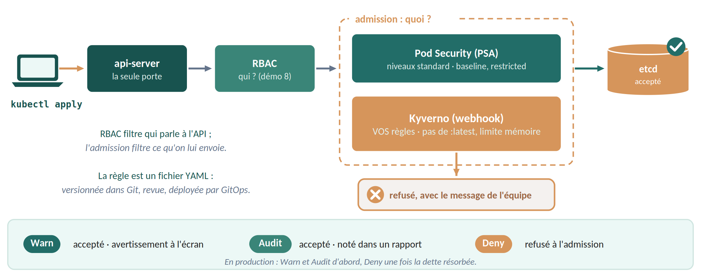


### 1. Ce que le vigile du J2 laisse passer

```sh
kubectl -n shopix run essai --image=nginx
kubectl -n shopix get pod essai -o jsonpath='image=… · limites=…'
```

❓ **Un nginx sans version, sans limite mémoire. Le namespace est en baseline. Passe-t-il ?**

<details><summary>Réponse</summary>

Oui : le PSA ne s'occupe que des privilèges. Ni la version (donc :latest implicite), ni les limites ne sont contrôlées.

</details>

**Ce que vous devez voir** — Le Pod est créé ; image=nginx, limites vides. « ✘ Il passe. »

**Pourquoi** — Deux problèmes classiques de production : :latest change sous vos pieds (un redémarrage peut tirer une autre version, et un rollback devient impossible) ; sans limite mémoire, un Pod peut affamer le nœud (démo 5). Aucun des deux n'est une question de sécurité au sens du PSA : ce sont des règles d'équipe.


### 2. On écrit la règle

```sh
cat k8s/demos/13-kyverno-politique.yaml
kubectl apply -f k8s/demos/13-kyverno-politique.yaml
```

**Ce que vous devez voir** — La ValidatingPolicy (policies.kyverno.io/v1) : validationActions Deny, autogen pour les Deployments, un namespaceSelector sur shopix, deux validations avec leur message ; puis « la politique est active à l'admission ».

**Pourquoi** — Kyverno est un webhook d'admission : l'api-server lui soumet chaque objet avant de l'écrire dans etcd. Depuis Kyverno 1.19, les règles s'écrivent en CEL, le même langage que les ValidatingAdmissionPolicy natives de Kubernetes : l'ancien format ClusterPolicy est déprécié. Le script vérifie que la règle est active par un essai à blanc (dry-run côté serveur), qui traverse les webhooks sans rien créer.


### 3. Le même nginx, maintenant

```sh
kubectl -n shopix run essai --image=nginx
kubectl -n shopix create deployment essai --image=nginx:1.27-alpine
```

❓ **Même commande qu'il y a une minute. Que va répondre l'api-server ? — Et si je contourne en passant par un Deployment ?**

<details><summary>Réponse</summary>

Refusé, avec les messages écrits dans la politique. Le Deployment est refusé aussi : version précise cette fois, mais pas de limite mémoire, et la règle a été générée pour les Deployments (autogen).

</details>

**Ce que vous devez voir** — Deux refus « denied the request » avec les messages de l'équipe.

**Pourquoi** — Le message est la moitié de la valeur d'une politique : un refus incompréhensible génère un ticket, un refus qui dit quoi corriger se corrige tout seul. L'autogen est un point fin mais important : les Pods ne sont presque jamais créés à la main, c'est le contrôleur qui les crée ; sans autogen, le refus arrive trop tard et en silence (les événements du ReplicaSet).


### 4. Ce qui respecte la règle passe

```sh
kubectl -n shopix get deploy shopix-front -o yaml | kubectl apply --dry-run=server -f -
```

**Ce que vous devez voir** — deployment.apps/shopix-front configured (server dry run).

**Pourquoi** — --dry-run=server est l'outil à connaître pour tester une politique sur l'existant sans rien casser — et, sur Kapsule, sans réveiller ArgoCD. En production, on le complète par la CLI kyverno dans la CI : les manifestes sont testés contre les politiques avant même d'atteindre le cluster.


### 5. En production, on ne commence jamais par Deny

```sh
kubectl patch validatingpolicies.policies.kyverno.io/shopix-bonnes-pratiques --type merge -p '{"spec":{"validationActions":["Warn","Audit"]}}'
kubectl -n shopix run essai --image=nginx
kubectl -n shopix get policyreport
```

❓ **Même nginx, en mode Warn. Refusé, accepté, ou autre chose ?**

<details><summary>Réponse</summary>

Accepté, avec un avertissement affiché par kubectl (« Warning: … ») ; et, en Audit, la non-conformité apparaît dans le rapport de politique du namespace.

</details>

**Ce que vous devez voir** — Le Pod est créé avec un avertissement ; le PolicyReport du namespace compte les résultats en échec (il peut mettre une trentaine de secondes à se remplir).

**Pourquoi** — La trajectoire classique : Audit pour mesurer la dette (le rapport liste ce qui est déjà non conforme), Warn pour prévenir les équipes, Deny quand la dette est résorbée. C'est l'écho des « guardrails plutôt que des barrières » du Module 9. Les rapports sont lisibles par les outils de tableau de bord (Policy Reporter).

**À retenir**

- Le PSA applique des niveaux standard ; Kyverno applique VOS règles, écrites en YAML.
- Elles se versionnent dans Git, se relisent en revue de code et se déploient par GitOps, comme le reste.
- Et on les introduit en douceur : Warn et Audit d'abord, Deny ensuite.

**Questions fréquentes**

- *« Kyverno ou OPA Gatekeeper ? »* Même rôle (webhook d'admission). Gatekeeper utilise Rego, un langage à part ; Kyverno reste en YAML et, depuis la 1.19, en CEL. Et Kubernetes propose nativement les ValidatingAdmissionPolicy (CEL, sans rien installer), qui couvrent les cas simples de validation ; Kyverno ajoute la mutation, la génération de ressources, les rapports et la vérification de signatures d'images.
- *« Et si Kyverno tombe ? »* C'est le point d'attention d'un webhook : selon sa politique d'échec, l'api-server refuse tout (Fail) ou laisse tout passer (Ignore). En production : plusieurs réplicas, et on exclut les namespaces système des règles.

**Revenir à l'état de départ :** `automatique (politique et objets d'essai supprimés) ; retirer Kyverno : ./demos/j3-03-kyverno.sh --desinstaller`


---

## Pour aller plus loin : six manipulations sans script

Elles se tapent à la main, sur le cluster Minikube avec Shopix déployé. Chacune se termine par sa remise en état.

### DaemonSet — un Pod par nœud

```sh
kubectl -n kube-system get ds
kubectl -n kube-system get pods -l k8s-app=calico-node -o wide
```

❓ **Combien de Pods Calico, et sur quels nœuds ?**

<details><summary>Réponse</summary>

Un par nœud. La colonne DESIRED du DaemonSet est égale au nombre de nœuds : un nœud ajouté reçoit son Pod automatiquement.

</details>

### StatefulSet — des noms et des disques stables

```sh
kubectl apply -f k8s/demos/12-statefulset.yaml
kubectl -n shopix get pods -l app=registre -w          # Ctrl-C quand les 3 sont Running
kubectl -n shopix get pvc -l app=registre
kubectl -n shopix exec registre-1 -- wget -q -O- --post-data='' 'http://127.0.0.1:8080/api/commandes?ref=SHX-777'; echo
kubectl -n shopix delete pod registre-1 --now
kubectl -n shopix exec registre-1 -- wget -q -O- http://127.0.0.1:8080/api/commandes; echo
```

❓ **Quel nom aura le Pod qui remplace `registre-1`, et retrouvera-t-il SHX-777 ?**

<details><summary>Réponse</summary>

`registre-1` à nouveau, avec le même disque : SHX-777 est toujours là. Les Pods naissent dans l'ordre (0, puis 1, puis 2), chacun avec son volume. À comparer avec un Deployment : nom aléatoire, nouvelle IP, rien de conservé.

</details>

Nettoyage : `kubectl delete -f k8s/demos/12-statefulset.yaml && kubectl -n shopix delete pvc -l app=registre` (les PVC survivent volontairement au StatefulSet).

### HPA — l'autoscaling horizontal

```sh
kubectl top pods -n shopix        # doit répondre (sinon : minikube -p ccs addons enable metrics-server)
kubectl apply -f k8s/demos/11-hpa.yaml
kubectl apply -f k8s/demos/tools.yaml
kubectl -n shopix exec tools -- sh -c 'for i in 1 2 3 4 5 6; do while true; do wget -q -O- http://shopix-api:8080/api/produits >/dev/null; done & done; sleep 600' &
kubectl -n shopix get hpa shopix-api -w
```

Sous la charge, l'utilisation CPU dépasse la cible de 60 % et le HPA ajoute des réplicas en une à deux minutes. Nettoyage, **impératif** (sinon le HPA reprend la main sur `shopix-api`) :

```sh
kubectl -n shopix delete pod tools --now
kubectl delete -f k8s/demos/11-hpa.yaml
kubectl -n shopix scale deploy shopix-api --replicas=2
```

### ConfigMap — changer l'application sans reconstruire l'image

```sh
kubectl -n shopix patch cm shopix-config --type merge -p '{"data":{"SHOPIX_MESSAGE":"Black Friday : -30 % sur tout","SHOPIX_COULEUR":"#D6955B"}}'
# rechargez la boutique : rien ne change
kubectl -n shopix rollout restart deploy shopix-front && kubectl -n shopix rollout status deploy shopix-front
# rechargez : bandeau orange, nouveau message
```

Une variable d'environnement est lue au démarrage du Pod : il faut le redémarrer. Remise en état : même commande `patch` avec `"Le e-commerce qui tient la charge"` et `"#18534F"`, puis `rollout restart`.

### Rolling update raté, puis rollback

```sh
kubectl -n shopix set image deploy/shopix-front front=shopix:9.9.9
kubectl -n shopix get pods -l composant=front
kubectl -n shopix rollout history deploy shopix-front
kubectl -n shopix rollout undo deploy shopix-front
```

❓ **La version 9.9.9 n'existe pas. La boutique tombe-t-elle ?**

<details><summary>Réponse</summary>

Non. Le nouveau Pod reste en `ErrImagePull`, les anciens continuent de servir : un rolling update ne retire l'ancienne version qu'une fois la nouvelle prête. Le retour arrière tient en une commande.

</details>

### ResourceQuota — limiter un namespace

```sh
N=$(( $(kubectl -n shopix get pods --no-headers --field-selector=status.phase=Running | wc -l) + 2 ))
kubectl -n shopix create quota demo-quota --hard=pods=$N
kubectl -n shopix scale deploy shopix-api --replicas=10
kubectl -n shopix get deploy shopix-api
kubectl -n shopix get events --sort-by=.lastTimestamp | grep -i quota | tail -3
kubectl -n shopix delete quota demo-quota && kubectl -n shopix scale deploy shopix-api --replicas=2
```

❓ **Au-delà du quota, les Pods sont-ils Pending ?**

<details><summary>Réponse</summary>

Non : ils ne sont même pas créés. Le refus a lieu à l'admission, et seul le ReplicaSet le signale dans ses événements (`FailedCreate … exceeded quota`). À comparer avec le Pending de la démo 5, où le Pod existe mais ne trouve pas de nœud.

</details>
